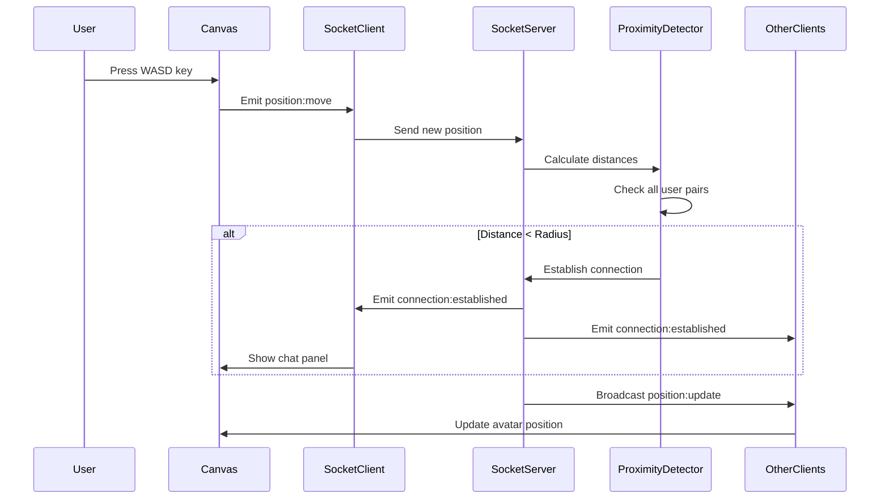

# Design Document: Virtual Cosmos

## Overview

Virtual Cosmos is a real-time, proximity-based virtual environment that enables spatial interaction between users in a 2D space. The system consists of three primary layers: a React-based frontend with PixiJS rendering, a Node.js/Express backend with Socket.IO for real-time communication, and MongoDB for optional persistence.

The core innovation is the proximity detection algorithm that automatically establishes and terminates chat connections based on Euclidean distance calculations between user positions. When users move within a configurable radius (default 150 pixels), a bidirectional connection is established, enabling real-time chat. When users move apart, the connection terminates automatically.

### Key Design Principles

1. **Real-time First**: All interactions prioritize low-latency communication (<100ms for critical events)
2. **Stateless Connections**: User state is maintained in-memory on the server; database persistence is optional
3. **Event-Driven Architecture**: Socket.IO events drive all state changes and UI updates
4. **Separation of Concerns**: Clear boundaries between rendering (PixiJS), state management (React), and business logic (Express)

### System Context

```
┌─────────────┐         WebSocket          ┌──────────────┐
│   Browser   │◄──────────────────────────►│ Socket.IO    │
│             │                             │ Server       │
│ React +     │         HTTP/REST           │              │
│ PixiJS      │◄──────────────────────────►│ Express.js   │
│             │                             │              │
└─────────────┘                             └──────┬───────┘
                                                   │
                                                   │ Mongoose
                                                   ▼
                                            ┌──────────────┐
                                            │   MongoDB    │
                                            │  (Optional)  │
                                            └──────────────┘
```

## Architecture

### High-Level Architecture

The system follows a client-server architecture with real-time bidirectional communication:

**Frontend (Client)**
- **Rendering Layer**: PixiJS manages the 2D canvas, avatar sprites, and visual effects
- **UI Layer**: React components handle chat panels, connection status, and controls
- **Communication Layer**: Socket.IO client manages WebSocket connections and event handling
- **State Management**: React Context API maintains local application state

**Backend (Server)**
- **API Layer**: Express.js provides REST endpoints for health checks and optional user info
- **Real-Time Layer**: Socket.IO server handles WebSocket connections and event broadcasting
- **Business Logic Layer**: Proximity detection, connection management, and message routing
- **Data Layer**: In-memory user state with optional MongoDB persistence

### Component Interaction Flow



### Data Flow Architecture

**Position Update Flow**:
1. User input → Movement Controller → Local position update
2. Socket Client → Emit position:move → Socket Server
3. Socket Server → Update in-memory state → Proximity Detector
4. Proximity Detector → Calculate distances → Connection decisions
5. Socket Server → Broadcast position:update → All clients
6. Clients → Update canvas → Render new positions

**Chat Message Flow**:
1. User input → Chat Panel → Socket Client
2. Socket Client → Emit chat:send → Socket Server
3. Socket Server → Validate & sanitize → Route to connected users only
4. Socket Server → Emit chat:message → Connected clients
5. Clients → Update Chat Panel → Display message

## Components and Interfaces

### Frontend Components

#### CosmosWorld.jsx
**Responsibility**: Manages the PixiJS application and renders the 2D canvas with all avatars.

**Interface**:
```javascript
interface CosmosWorldProps {
  users: Map<string, User>;
  currentUserId: string;
  onPositionUpdate: (position: {x: number, y: number}) => void;
}

interface User {
  userId: string;
  username: string;
  position: {x: number, y: number};
  isConnected: boolean;
}
```

**Key Methods**:
- `initializePixiApp()`: Creates PixiJS application and attaches to DOM
- `renderAvatar(user)`: Creates/updates avatar sprite for a user
- `removeAvatar(userId)`: Removes avatar when user disconnects
- `handleKeyboardInput()`: Processes WASD/Arrow key input
- `updateAvatarPosition(userId, position)`: Smoothly animates avatar movement

#### ChatPanel.jsx
**Responsibility**: Displays chat interface when users are in proximity.

**Interface**:
```javascript
interface ChatPanelProps {
  connections: Array<Connection>;
  messages: Array<Message>;
  onSendMessage: (message: string) => void;
  isVisible: boolean;
}

interface Connection {
  userId: string;
  username: string;
}

interface Message {
  userId: string;
  username: string;
  message: string;
  timestamp: number;
}
```

**Key Methods**:
- `handleMessageSubmit(message)`: Validates and sends chat message
- `renderMessage(message)`: Displays individual message with timestamp
- `scrollToBottom()`: Auto-scrolls to latest message

#### ConnectionStatus.jsx
**Responsibility**: Displays active user count and connection status.

**Interface**:
```javascript
interface ConnectionStatusProps {
  activeUsers: number;
  isConnected: boolean;
  connections: Array<string>; // userIds
}
```

### Frontend Services

#### socket.js
**Responsibility**: Singleton Socket.IO client instance managing server connection.

**Interface**:
```javascript
class SocketService {
  connect(username: string): void;
  disconnect(): void;
  emitPositionMove(position: {x: number, y: number}): void;
  emitChatSend(message: string): void;
  onUserJoined(callback: (data) => void): void;
  onUserLeft(callback: (data) => void): void;
  onPositionUpdate(callback: (data) => void): void;
  onConnectionEstablished(callback: (data) => void): void;
  onConnectionTerminated(callback: (data) => void): void;
  onChatMessage(callback: (data) => void): void;
  onUsersList(callback: (data) => void): void;
}
```

### Backend Components

#### Server Structure
```
backend/
├── server.js              # Entry point, Express + Socket.IO setup
├── config/
│   └── db.js             # MongoDB connection (optional)
├── middleware/
│   ├── errorHandler.js   # Global error handling
│   ├── rateLimiter.js    # Rate limiting for position updates
│   └── validator.js      # Input validation middleware
├── services/
│   ├── proximityDetector.js    # Core proximity algorithm
│   ├── connectionManager.js    # Connection lifecycle management
│   └── userStateManager.js     # In-memory user state
├── handlers/
│   ├── socketHandlers.js       # Socket.IO event handlers
│   └── connectionHandlers.js   # Connection/disconnection logic
├── models/
│   ├── User.js           # Mongoose user schema (optional)
│   └── Session.js        # Mongoose session schema (optional)
└── routes/
    └── api.js            # REST API endpoints
```

#### ProximityDetector Service
**Responsibility**: Calculates distances and manages connection state.

**Interface**:
```javascript
class ProximityDetector {
  constructor(radius = 150);
  
  checkProximity(user1, user2): boolean;
  calculateDistance(pos1, pos2): number;
  updateConnections(userId, allUsers): {
    newConnections: Array<string>,
    terminatedConnections: Array<string>
  };
  getConnectedUsers(userId): Array<string>;
}
```

**Algorithm**:
```javascript
calculateDistance(pos1, pos2) {
  const dx = pos1.x - pos2.x;
  const dy = pos1.y - pos2.y;
  return Math.sqrt(dx * dx + dy * dy);
}

checkProximity(user1, user2) {
  const distance = this.calculateDistance(user1.position, user2.position);
  return distance < this.radius;
}
```

#### UserStateManager Service
**Responsibility**: Maintains in-memory user state and provides query methods.

**Interface**:
```javascript
class UserStateManager {
  addUser(socketId, userData): void;
  removeUser(socketId): void;
  updatePosition(socketId, position): void;
  getUser(socketId): User | null;
  getAllUsers(): Map<string, User>;
  getUserCount(): number;
  addConnection(userId1, userId2): void;
  removeConnection(userId1, userId2): void;
  getConnections(userId): Array<string>;
}
```

**State Structure**:
```javascript
{
  socketId: {
    userId: string,
    username: string,
    position: {x: number, y: number},
    connections: Set<string>,  // Set of connected userIds
    lastUpdate: timestamp
  }
}
```

#### ConnectionManager Service
**Responsibility**: Manages connection lifecycle and chat room logic.

**Interface**:
```javascript
class ConnectionManager {
  establishConnection(socket, userId1, userId2): void;
  terminateConnection(socket, userId1, userId2): void;
  notifyConnection(socket, userId, connectedUserId, username): void;
  notifyDisconnection(socket, userId, disconnectedUserId): void;
}
```

### Socket.IO Event Handlers

#### Client → Server Events

**user:join**
```javascript
socket.on('user:join', (data) => {
  // data: { username: string }
  // Response: Emit users:list with all active users
  // Broadcast: user:joined to all other clients
});
```

**position:move**
```javascript
socket.on('position:move', (data) => {
  // data: { x: number, y: number }
  // Validation: Check numeric values, boundary limits
  // Process: Update state, check proximity, broadcast
  // Rate limit: 100 updates/second per user
});
```

**chat:send**
```javascript
socket.on('chat:send', (data) => {
  // data: { message: string }
  // Validation: Max 500 characters, XSS sanitization
  // Process: Route to connected users only
});
```

**user:leave**
```javascript
socket.on('user:leave', () => {
  // Process: Terminate all connections, remove from state
  // Broadcast: user:left to all clients
});
```

#### Server → Client Events

**users:list**
```javascript
socket.emit('users:list', {
  users: [
    {
      userId: string,
      username: string,
      position: {x: number, y: number}
    }
  ]
});
```

**user:joined**
```javascript
io.emit('user:joined', {
  userId: string,
  username: string,
  position: {x: number, y: number}
});
```

**user:left**
```javascript
io.emit('user:left', {
  userId: string
});
```

**position:update**
```javascript
io.emit('position:update', {
  userId: string,
  position: {x: number, y: number}
});
```

**connection:established**
```javascript
socket.emit('connection:established', {
  userId: string,
  username: string
});
```

**connection:terminated**
```javascript
socket.emit('connection:terminated', {
  userId: string
});
```

**chat:message**
```javascript
socket.to(connectedUsers).emit('chat:message', {
  userId: string,
  username: string,
  message: string,
  timestamp: number
});
```

## Data Models

### In-Memory State (Primary)

The server maintains all active user state in memory for performance. This is the source of truth during runtime.

**User State**:
```javascript
const userState = new Map();
// Key: socketId (string)
// Value: {
//   userId: string,           // Same as socketId for simplicity
//   username: string,
//   position: {
//     x: number,              // Canvas x-coordinate
//     y: number               // Canvas y-coordinate
//   },
//   connections: Set<string>, // Set of connected user socketIds
//   lastUpdate: number        // Timestamp of last position update
// }
```

**Connection Graph**:
```javascript
// Bidirectional adjacency list
const connections = new Map();
// Key: userId (string)
// Value: Set<string> of connected userIds
```

### MongoDB Schemas (Optional Persistence)

#### User Schema
```javascript
const UserSchema = new mongoose.Schema({
  userId: {
    type: String,
    required: true,
    unique: true
  },
  username: {
    type: String,
    required: true,
    minlength: 1,
    maxlength: 50
  },
  lastPosition: {
    x: {type: Number, default: 0},
    y: {type: Number, default: 0}
  },
  lastSeen: {
    type: Date,
    default: Date.now
  },
  createdAt: {
    type: Date,
    default: Date.now
  }
});
```

#### Session Schema
```javascript
const SessionSchema = new mongoose.Schema({
  sessionId: {
    type: String,
    required: true,
    unique: true
  },
  users: [{
    type: String  // Array of userIds
  }],
  startTime: {
    type: Date,
    default: Date.now
  },
  endTime: Date,
  messageCount: {
    type: Number,
    default: 0
  },
  averageUsers: Number,
  peakUsers: Number
});
```

### Data Persistence Strategy

**In-Memory (Required)**:
- Active user positions and connections
- Real-time state for proximity detection
- Chat message routing information

**Database (Optional)**:
- User profiles and last known positions
- Session analytics and metrics
- Historical data for debugging

**Persistence Triggers**:
- User disconnect → Save last position to MongoDB
- Session end → Save session metrics
- Periodic snapshots → Every 5 minutes for analytics

## Proximity Detection Algorithm

### Core Algorithm

The proximity detection algorithm is the heart of Virtual Cosmos. It runs on every position update and determines which users should be connected.

**Pseudocode**:
```
FUNCTION updateConnections(userId, newPosition, allUsers, radius):
  // Update user's position
  userState[userId].position = newPosition
  
  // Track changes
  newConnections = []
  terminatedConnections = []
  
  // Check proximity with all other users
  FOR EACH otherUserId IN allUsers:
    IF otherUserId == userId:
      CONTINUE
    
    // Calculate distance
    distance = calculateEuclideanDistance(
      userState[userId].position,
      userState[otherUserId].position
    )
    
    // Check current connection status
    wasConnected = userState[userId].connections.has(otherUserId)
    inProximity = distance < radius
    
    // State transition logic
    IF inProximity AND NOT wasConnected:
      // Establish new connection
      userState[userId].connections.add(otherUserId)
      userState[otherUserId].connections.add(userId)
      newConnections.push(otherUserId)
      
    ELSE IF NOT inProximity AND wasConnected:
      // Terminate existing connection
      userState[userId].connections.delete(otherUserId)
      userState[otherUserId].connections.delete(userId)
      terminatedConnections.push(otherUserId)
  
  RETURN {newConnections, terminatedConnections}

FUNCTION calculateEuclideanDistance(pos1, pos2):
  dx = pos1.x - pos2.x
  dy = pos1.y - pos2.y
  RETURN sqrt(dx * dx + dy * dy)
```

### Implementation Details

**JavaScript Implementation**:
```javascript
class ProximityDetector {
  constructor(radius = 150) {
    this.radius = radius;
  }

  calculateDistance(pos1, pos2) {
    const dx = pos1.x - pos2.x;
    const dy = pos1.y - pos2.y;
    return Math.sqrt(dx * dx + dy * dy);
  }

  checkProximity(user1, user2) {
    return this.calculateDistance(user1.position, user2.position) < this.radius;
  }

  updateConnections(userId, allUsers) {
    const newConnections = [];
    const terminatedConnections = [];
    const currentUser = allUsers.get(userId);

    if (!currentUser) return {newConnections, terminatedConnections};

    for (const [otherUserId, otherUser] of allUsers) {
      if (otherUserId === userId) continue;

      const distance = this.calculateDistance(
        currentUser.position,
        otherUser.position
      );
      
      const wasConnected = currentUser.connections.has(otherUserId);
      const inProximity = distance < this.radius;

      if (inProximity && !wasConnected) {
        // Establish connection
        currentUser.connections.add(otherUserId);
        otherUser.connections.add(userId);
        newConnections.push({
          userId: otherUserId,
          username: otherUser.username
        });
      } else if (!inProximity && wasConnected) {
        // Terminate connection
        currentUser.connections.delete(otherUserId);
        otherUser.connections.delete(userId);
        terminatedConnections.push(otherUserId);
      }
    }

    return {newConnections, terminatedConnections};
  }
}
```

### Optimization Strategies

**Current Implementation (Naive)**:
- Time Complexity: O(n) per position update, where n = number of users
- Space Complexity: O(n²) for connection graph in worst case
- Suitable for: Up to 50 concurrent users

**Future Optimizations** (if scaling beyond 50 users):

1. **Spatial Partitioning (Grid-Based)**:
   - Divide canvas into grid cells
   - Only check proximity within same cell and adjacent cells
   - Time Complexity: O(k) where k = users per cell (typically k << n)
   
   ```javascript
   class SpatialGrid {
     constructor(cellSize = 200) {
       this.cellSize = cellSize;
       this.grid = new Map(); // Map<cellKey, Set<userId>>
     }
     
     getCellKey(position) {
       const cellX = Math.floor(position.x / this.cellSize);
       const cellY = Math.floor(position.y / this.cellSize);
       return `${cellX},${cellY}`;
     }
     
     getNearbyUsers(position) {
       const cellKey = this.getCellKey(position);
       // Return users in current cell + 8 adjacent cells
     }
   }
   ```

2. **Quadtree Spatial Index**:
   - Hierarchical spatial partitioning
   - Efficient for non-uniform user distribution
   - Time Complexity: O(log n + k)

3. **Distance Caching**:
   - Cache distance calculations between position updates
   - Only recalculate when either user moves
   - Reduces redundant sqrt() operations

### Edge Cases

**Case 1: Simultaneous Movement**
- Two users moving toward each other
- Solution: Server processes position updates sequentially; connection established when first update brings them within radius

**Case 2: Boundary Conditions**
- User at canvas edge, other user wrapping around
- Solution: Validate positions before distance calculation; reject out-of-bounds positions

**Case 3: Rapid Connect/Disconnect**
- Users moving back and forth across radius boundary
- Solution: Implement hysteresis (different thresholds for connect vs disconnect)
  ```javascript
  const CONNECT_RADIUS = 150;
  const DISCONNECT_RADIUS = 160; // 10px buffer
  ```

**Case 4: Three-Way Proximity**
- User A connects to B, B connects to C, but A and C not in range
- Solution: Connections are pairwise; each pair maintains independent connection state

**Case 5: User Disconnects Mid-Connection**
- User leaves while connected to others
- Solution: On disconnect event, iterate through user's connections and notify all connected users

### Performance Considerations

**Throttling Position Updates**:
```javascript
// Client-side throttling
const POSITION_UPDATE_INTERVAL = 16; // ~60 updates/second
let lastUpdateTime = 0;

function sendPositionUpdate(position) {
  const now = Date.now();
  if (now - lastUpdateTime < POSITION_UPDATE_INTERVAL) {
    return; // Skip this update
  }
  lastUpdateTime = now;
  socket.emit('position:move', position);
}
```

**Server-Side Rate Limiting**:
```javascript
const rateLimit = new Map(); // userId -> {count, resetTime}

function checkRateLimit(userId) {
  const limit = rateLimit.get(userId) || {count: 0, resetTime: Date.now() + 1000};
  
  if (Date.now() > limit.resetTime) {
    limit.count = 0;
    limit.resetTime = Date.now() + 1000;
  }
  
  limit.count++;
  rateLimit.set(userId, limit);
  
  return limit.count <= 100; // Max 100 updates per second
}
```

**Broadcast Optimization**:
```javascript
// Instead of individual emits, batch position updates
const positionUpdates = [];

// Collect updates
positionUpdates.push({userId, position});

// Broadcast batch every 16ms
setInterval(() => {
  if (positionUpdates.length > 0) {
    io.emit('position:batch', positionUpdates);
    positionUpdates.length = 0;
  }
}, 16);
```

## Correctness Properties

*A property is a characteristic or behavior that should hold true across all valid executions of a system—essentially, a formal statement about what the system should do. Properties serve as the bridge between human-readable specifications and machine-verifiable correctness guarantees.*

Virtual Cosmos contains several core algorithms and validation functions that are suitable for property-based testing. While much of the system involves real-time networking (Socket.IO), UI rendering (PixiJS), and infrastructure concerns (which are better tested through integration and example-based tests), the following pure functions exhibit universal properties that should hold across all valid inputs.

### Property 1: Euclidean Distance Calculation Correctness

*For any* two positions pos1 and pos2 with numeric coordinates, the calculated distance SHALL equal sqrt((pos1.x - pos2.x)² + (pos1.y - pos2.y)²) within floating-point precision tolerance.

**Validates: Requirements 4.5**

**Rationale**: The proximity detection algorithm depends on accurate distance calculations. This property ensures the mathematical correctness of the core distance function.

**Test Implementation**:
```javascript
// Using fast-check (JavaScript PBT library)
fc.assert(
  fc.property(
    fc.record({x: fc.float(), y: fc.float()}),
    fc.record({x: fc.float(), y: fc.float()}),
    (pos1, pos2) => {
      const calculated = proximityDetector.calculateDistance(pos1, pos2);
      const dx = pos1.x - pos2.x;
      const dy = pos1.y - pos2.y;
      const expected = Math.sqrt(dx * dx + dy * dy);
      
      // Allow small floating-point error
      return Math.abs(calculated - expected) < 0.0001;
    }
  ),
  { numRuns: 100 }
);
```

### Property 2: Position Boundary Validation

*For any* position update with coordinates (x, y), if x or y falls outside the valid canvas boundaries [0, canvasWidth] × [0, canvasHeight], the validation function SHALL reject the position.

**Validates: Requirements 2.5, 10.2**

**Rationale**: Preventing out-of-bounds positions ensures avatars remain visible and prevents rendering errors.

**Test Implementation**:
```javascript
fc.assert(
  fc.property(
    fc.record({
      x: fc.float({min: -1000, max: 2000}),
      y: fc.float({min: -1000, max: 2000})
    }),
    (position) => {
      const isValid = validator.isPositionValid(position, CANVAS_WIDTH, CANVAS_HEIGHT);
      const expectedValid = (
        position.x >= 0 && position.x <= CANVAS_WIDTH &&
        position.y >= 0 && position.y <= CANVAS_HEIGHT
      );
      return isValid === expectedValid;
    }
  ),
  { numRuns: 100 }
);
```

### Property 3: Connection State Transitions

*For any* two users with positions pos1 and pos2, when the distance between them transitions from >= radius to < radius, a connection SHALL be established; when the distance transitions from < radius to >= radius, the connection SHALL be terminated.

**Validates: Requirements 4.2, 6.1**

**Rationale**: This property captures the core proximity-based connection logic. Connection state must accurately reflect distance relative to the proximity radius.

**Test Implementation**:
```javascript
fc.assert(
  fc.property(
    fc.record({x: fc.float({min: 0, max: 800}), y: fc.float({min: 0, max: 600})}),
    fc.record({x: fc.float({min: 0, max: 800}), y: fc.float({min: 0, max: 600})}),
    fc.float({min: 50, max: 300}), // radius
    (pos1, pos2, radius) => {
      const user1 = {userId: 'user1', position: pos1, connections: new Set()};
      const user2 = {userId: 'user2', position: pos2, connections: new Set()};
      const users = new Map([['user1', user1], ['user2', user2]]);
      
      const detector = new ProximityDetector(radius);
      const distance = detector.calculateDistance(pos1, pos2);
      
      detector.updateConnections('user1', users);
      
      const isConnected = user1.connections.has('user2');
      const shouldBeConnected = distance < radius;
      
      return isConnected === shouldBeConnected;
    }
  ),
  { numRuns: 100 }
);
```

### Property 4: Message Length Validation

*For any* chat message string, if the length exceeds 500 characters, the validation function SHALL reject the message.

**Validates: Requirements 5.5**

**Rationale**: Enforcing message length limits prevents abuse and ensures consistent UI rendering.

**Test Implementation**:
```javascript
fc.assert(
  fc.property(
    fc.string({minLength: 0, maxLength: 1000}),
    (message) => {
      const isValid = validator.isMessageValid(message);
      const expectedValid = message.length <= 500;
      return isValid === expectedValid;
    }
  ),
  { numRuns: 100 }
);
```

### Property 5: Message Chronological Ordering

*For any* array of messages with timestamp fields, the sorting function SHALL order messages such that for all adjacent pairs (msg[i], msg[i+1]), msg[i].timestamp <= msg[i+1].timestamp.

**Validates: Requirements 5.6**

**Rationale**: Chat messages must appear in chronological order for coherent conversations.

**Test Implementation**:
```javascript
fc.assert(
  fc.property(
    fc.array(
      fc.record({
        userId: fc.string(),
        message: fc.string(),
        timestamp: fc.integer({min: 0, max: Date.now()})
      }),
      {minLength: 0, maxLength: 50}
    ),
    (messages) => {
      const sorted = chatService.sortMessagesByTimestamp(messages);
      
      // Check all adjacent pairs are in order
      for (let i = 0; i < sorted.length - 1; i++) {
        if (sorted[i].timestamp > sorted[i + 1].timestamp) {
          return false;
        }
      }
      return true;
    }
  ),
  { numRuns: 100 }
);
```

### Property 6: Numeric Input Validation

*For any* input value, the numeric validation function SHALL return true if and only if the value is a finite number (not NaN, not Infinity, not a string, not null, not undefined).

**Validates: Requirements 10.1**

**Rationale**: Position coordinates must be valid numbers to prevent calculation errors and rendering issues.

**Test Implementation**:
```javascript
fc.assert(
  fc.property(
    fc.anything(),
    (input) => {
      const isValid = validator.isNumeric(input);
      const expectedValid = (
        typeof input === 'number' &&
        !isNaN(input) &&
        isFinite(input)
      );
      return isValid === expectedValid;
    }
  ),
  { numRuns: 100 }
);
```

### Property 7: XSS Sanitization

*For any* string input containing HTML tags or JavaScript code, the sanitization function SHALL return a string that does not execute scripts when rendered in the DOM.

**Validates: Requirements 10.3**

**Rationale**: Chat messages must be sanitized to prevent XSS attacks that could compromise user security.

**Test Implementation**:
```javascript
fc.assert(
  fc.property(
    fc.string(),
    (input) => {
      const sanitized = validator.sanitizeMessage(input);
      
      // Sanitized output should not contain script tags
      const hasScriptTag = /<script/i.test(sanitized);
      
      // Sanitized output should not contain event handlers
      const hasEventHandler = /on\w+\s*=/i.test(sanitized);
      
      // Sanitized output should not contain javascript: protocol
      const hasJsProtocol = /javascript:/i.test(sanitized);
      
      return !hasScriptTag && !hasEventHandler && !hasJsProtocol;
    }
  ),
  { numRuns: 100 }
);
```

### Property 8: Username Length Validation

*For any* username string, the validation function SHALL return true if and only if the length is between 1 and 50 characters (inclusive).

**Validates: Requirements 10.4**

**Rationale**: Username length constraints ensure consistent UI rendering and prevent abuse.

**Test Implementation**:
```javascript
fc.assert(
  fc.property(
    fc.string({minLength: 0, maxLength: 100}),
    (username) => {
      const isValid = validator.isUsernameValid(username);
      const expectedValid = username.length >= 1 && username.length <= 50;
      return isValid === expectedValid;
    }
  ),
  { numRuns: 100 }
);
```

## Error Handling

### Error Categories

**Client-Side Errors**:
1. **Network Errors**: Connection failures, timeouts, disconnections
2. **Validation Errors**: Invalid user input (empty username, out-of-bounds movement)
3. **Rendering Errors**: PixiJS initialization failures, canvas errors
4. **State Errors**: Inconsistent state after reconnection

**Server-Side Errors**:
1. **Validation Errors**: Invalid position data, malformed messages
2. **Rate Limiting Errors**: Too many requests from a single user
3. **State Errors**: User not found, invalid connection state
4. **Database Errors**: MongoDB connection failures (if persistence enabled)

### Error Handling Strategies

**Client-Side Error Handling**:

```javascript
// Socket connection error handling
socket.on('connect_error', (error) => {
  console.error('Connection failed:', error);
  showNotification('Unable to connect to server. Retrying...', 'error');
  // Socket.IO automatically retries connection
});

socket.on('disconnect', (reason) => {
  console.warn('Disconnected:', reason);
  if (reason === 'io server disconnect') {
    // Server forcibly disconnected, manual reconnection needed
    socket.connect();
  }
  showNotification('Connection lost. Reconnecting...', 'warning');
});

socket.on('reconnect', (attemptNumber) => {
  console.log('Reconnected after', attemptNumber, 'attempts');
  showNotification('Reconnected successfully', 'success');
  // Re-sync state with server
  socket.emit('user:join', {username: currentUsername});
});

// PixiJS error handling
try {
  const app = new PIXI.Application({
    width: 800,
    height: 600,
    backgroundColor: 0x1a1a2e
  });
  document.getElementById('canvas-container').appendChild(app.view);
} catch (error) {
  console.error('Failed to initialize PixiJS:', error);
  showNotification('Canvas initialization failed. Please refresh the page.', 'error');
}

// Input validation
function handleMovement(key) {
  const newPosition = calculateNewPosition(currentPosition, key);
  
  if (!isValidPosition(newPosition)) {
    console.warn('Invalid position:', newPosition);
    return; // Don't send invalid position to server
  }
  
  socket.emit('position:move', newPosition);
}
```

**Server-Side Error Handling**:

```javascript
// Global error handler middleware
app.use((err, req, res, next) => {
  console.error('Server error:', err);
  res.status(500).json({
    error: 'Internal server error',
    message: process.env.NODE_ENV === 'development' ? err.message : undefined
  });
});

// Socket event error handling
socket.on('position:move', (data) => {
  try {
    // Validate input
    if (!validator.isNumeric(data.x) || !validator.isNumeric(data.y)) {
      socket.emit('error', {
        type: 'validation_error',
        message: 'Position coordinates must be numeric'
      });
      return;
    }
    
    if (!validator.isPositionValid(data, CANVAS_WIDTH, CANVAS_HEIGHT)) {
      socket.emit('error', {
        type: 'validation_error',
        message: 'Position out of bounds'
      });
      return;
    }
    
    // Rate limiting
    if (!rateLimiter.checkLimit(socket.id)) {
      socket.emit('error', {
        type: 'rate_limit_error',
        message: 'Too many position updates. Please slow down.'
      });
      return;
    }
    
    // Process position update
    userStateManager.updatePosition(socket.id, data);
    const {newConnections, terminatedConnections} = 
      proximityDetector.updateConnections(socket.id, userStateManager.getAllUsers());
    
    // Notify about connection changes
    newConnections.forEach(conn => {
      connectionManager.establishConnection(io, socket.id, conn.userId, conn.username);
    });
    
    terminatedConnections.forEach(userId => {
      connectionManager.terminateConnection(io, socket.id, userId);
    });
    
    // Broadcast position update
    io.emit('position:update', {
      userId: socket.id,
      position: data
    });
    
  } catch (error) {
    console.error('Error processing position update:', error);
    socket.emit('error', {
      type: 'server_error',
      message: 'Failed to process position update'
    });
  }
});

// Chat message error handling
socket.on('chat:send', (data) => {
  try {
    // Validate message
    if (!data.message || typeof data.message !== 'string') {
      socket.emit('error', {
        type: 'validation_error',
        message: 'Invalid message format'
      });
      return;
    }
    
    if (!validator.isMessageValid(data.message)) {
      socket.emit('error', {
        type: 'validation_error',
        message: 'Message exceeds maximum length (500 characters)'
      });
      return;
    }
    
    // Sanitize message
    const sanitizedMessage = validator.sanitizeMessage(data.message);
    
    // Get user's connections
    const user = userStateManager.getUser(socket.id);
    if (!user) {
      socket.emit('error', {
        type: 'state_error',
        message: 'User not found'
      });
      return;
    }
    
    // Send to connected users only
    const connections = Array.from(user.connections);
    connections.forEach(connectedUserId => {
      io.to(connectedUserId).emit('chat:message', {
        userId: socket.id,
        username: user.username,
        message: sanitizedMessage,
        timestamp: Date.now()
      });
    });
    
    // Echo back to sender
    socket.emit('chat:message', {
      userId: socket.id,
      username: user.username,
      message: sanitizedMessage,
      timestamp: Date.now()
    });
    
  } catch (error) {
    console.error('Error processing chat message:', error);
    socket.emit('error', {
      type: 'server_error',
      message: 'Failed to send message'
    });
  }
});

// Database error handling (if MongoDB enabled)
mongoose.connection.on('error', (err) => {
  console.error('MongoDB connection error:', err);
  // Continue operating with in-memory state only
});

mongoose.connection.on('disconnected', () => {
  console.warn('MongoDB disconnected. Operating in memory-only mode.');
});
```

### Error Recovery Strategies

**Automatic Reconnection**:
- Socket.IO client automatically attempts reconnection with exponential backoff
- On successful reconnection, client re-sends user:join event to restore state
- Server sends current users list to re-sync client state

**State Reconciliation**:
- After reconnection, client requests full user list from server
- Client compares local state with server state and updates accordingly
- Orphaned connections are cleaned up

**Graceful Degradation**:
- If MongoDB is unavailable, system continues with in-memory state only
- If position updates fail, client retains last known position
- If chat messages fail, user receives error notification but can retry

**User Notifications**:
- All errors are logged to console for debugging
- User-facing errors are displayed as non-intrusive notifications
- Critical errors (connection loss) are prominently displayed

## Testing Strategy

Virtual Cosmos requires a multi-layered testing approach due to its hybrid nature: pure algorithmic logic (suitable for property-based testing), real-time networking (requiring integration tests), and UI rendering (requiring example-based tests).

### Testing Layers

**1. Property-Based Tests (Unit Level)**

Property-based tests verify the correctness of pure functions and algorithms across a wide range of inputs. These tests use the `fast-check` library for JavaScript.

**Target Components**:
- Proximity detection algorithm (distance calculation, connection logic)
- Input validation functions (position, message, username)
- Message sanitization
- Message sorting

**Configuration**:
- Minimum 100 iterations per property test
- Each test references its design document property
- Tag format: `Feature: virtual-cosmos, Property {number}: {property_text}`

**Example Test Structure**:
```javascript
// tests/unit/proximityDetector.property.test.js
const fc = require('fast-check');
const ProximityDetector = require('../../services/proximityDetector');

describe('ProximityDetector - Property-Based Tests', () => {
  test('Feature: virtual-cosmos, Property 1: Euclidean distance calculation correctness', () => {
    fc.assert(
      fc.property(
        fc.record({x: fc.float(), y: fc.float()}),
        fc.record({x: fc.float(), y: fc.float()}),
        (pos1, pos2) => {
          const detector = new ProximityDetector();
          const calculated = detector.calculateDistance(pos1, pos2);
          const dx = pos1.x - pos2.x;
          const dy = pos1.y - pos2.y;
          const expected = Math.sqrt(dx * dx + dy * dy);
          return Math.abs(calculated - expected) < 0.0001;
        }
      ),
      { numRuns: 100 }
    );
  });
  
  test('Feature: virtual-cosmos, Property 3: Connection state transitions', () => {
    fc.assert(
      fc.property(
        fc.record({x: fc.float({min: 0, max: 800}), y: fc.float({min: 0, max: 600})}),
        fc.record({x: fc.float({min: 0, max: 800}), y: fc.float({min: 0, max: 600})}),
        fc.float({min: 50, max: 300}),
        (pos1, pos2, radius) => {
          const user1 = {userId: 'user1', position: pos1, connections: new Set()};
          const user2 = {userId: 'user2', position: pos2, connections: new Set()};
          const users = new Map([['user1', user1], ['user2', user2]]);
          
          const detector = new ProximityDetector(radius);
          const distance = detector.calculateDistance(pos1, pos2);
          
          detector.updateConnections('user1', users);
          
          const isConnected = user1.connections.has('user2');
          const shouldBeConnected = distance < radius;
          
          return isConnected === shouldBeConnected;
        }
      ),
      { numRuns: 100 }
    );
  });
});
```

**2. Example-Based Unit Tests**

Example-based tests verify specific scenarios, edge cases, and UI behavior with concrete test cases.

**Target Components**:
- React components (ChatPanel, ConnectionStatus, CosmosWorld)
- Socket event handlers (specific event sequences)
- Edge cases (empty messages, boundary positions, disconnection scenarios)

**Testing Library**: Jest + React Testing Library

**Example Test Structure**:
```javascript
// tests/unit/ChatPanel.test.js
import { render, screen, fireEvent } from '@testing-library/react';
import ChatPanel from '../../components/ChatPanel';

describe('ChatPanel - Example-Based Tests', () => {
  test('displays message input when connections exist', () => {
    const connections = [{userId: 'user1', username: 'Alice'}];
    render(<ChatPanel connections={connections} messages={[]} isVisible={true} />);
    
    expect(screen.getByPlaceholderText(/type a message/i)).toBeInTheDocument();
  });
  
  test('hides panel when no connections', () => {
    const { container } = render(
      <ChatPanel connections={[]} messages={[]} isVisible={false} />
    );
    
    expect(container.firstChild).toHaveClass('hidden');
  });
  
  test('displays messages in chronological order', () => {
    const messages = [
      {userId: 'user1', username: 'Alice', message: 'First', timestamp: 1000},
      {userId: 'user2', username: 'Bob', message: 'Second', timestamp: 2000}
    ];
    
    render(<ChatPanel connections={[]} messages={messages} isVisible={true} />);
    
    const messageElements = screen.getAllByTestId('chat-message');
    expect(messageElements[0]).toHaveTextContent('First');
    expect(messageElements[1]).toHaveTextContent('Second');
  });
});
```

**3. Integration Tests**

Integration tests verify the interaction between frontend and backend, Socket.IO event flow, and end-to-end scenarios.

**Target Scenarios**:
- User connection and disconnection flow
- Position updates and broadcasting
- Proximity detection triggering connections
- Chat message routing to connected users only
- Reconnection and state restoration

**Testing Library**: Jest + Socket.IO Client + Supertest

**Example Test Structure**:
```javascript
// tests/integration/proximity.test.js
const io = require('socket.io-client');
const { createServer } = require('../../server');

describe('Proximity Detection - Integration Tests', () => {
  let server, clientSocket1, clientSocket2;
  
  beforeAll((done) => {
    server = createServer();
    server.listen(3001, done);
  });
  
  afterAll(() => {
    server.close();
  });
  
  beforeEach((done) => {
    clientSocket1 = io('http://localhost:3001');
    clientSocket2 = io('http://localhost:3001');
    
    let connectedCount = 0;
    const checkBothConnected = () => {
      connectedCount++;
      if (connectedCount === 2) done();
    };
    
    clientSocket1.on('connect', checkBothConnected);
    clientSocket2.on('connect', checkBothConnected);
  });
  
  afterEach(() => {
    clientSocket1.disconnect();
    clientSocket2.disconnect();
  });
  
  test('establishes connection when users move within proximity radius', (done) => {
    clientSocket1.emit('user:join', {username: 'Alice'});
    clientSocket2.emit('user:join', {username: 'Bob'});
    
    // Move users close together
    clientSocket1.emit('position:move', {x: 100, y: 100});
    clientSocket2.emit('position:move', {x: 150, y: 100}); // 50px apart
    
    clientSocket1.on('connection:established', (data) => {
      expect(data.username).toBe('Bob');
      done();
    });
  });
  
  test('terminates connection when users move apart', (done) => {
    // First establish connection
    clientSocket1.emit('user:join', {username: 'Alice'});
    clientSocket2.emit('user:join', {username: 'Bob'});
    clientSocket1.emit('position:move', {x: 100, y: 100});
    clientSocket2.emit('position:move', {x: 150, y: 100});
    
    clientSocket1.once('connection:established', () => {
      // Now move apart
      clientSocket2.emit('position:move', {x: 500, y: 500});
      
      clientSocket1.on('connection:terminated', (data) => {
        expect(data.userId).toBe(clientSocket2.id);
        done();
      });
    });
  });
  
  test('routes chat messages only to connected users', (done) => {
    clientSocket1.emit('user:join', {username: 'Alice'});
    clientSocket2.emit('user:join', {username: 'Bob'});
    
    // Establish connection
    clientSocket1.emit('position:move', {x: 100, y: 100});
    clientSocket2.emit('position:move', {x: 150, y: 100});
    
    clientSocket1.once('connection:established', () => {
      clientSocket1.emit('chat:send', {message: 'Hello Bob!'});
      
      clientSocket2.on('chat:message', (data) => {
        expect(data.message).toBe('Hello Bob!');
        expect(data.username).toBe('Alice');
        done();
      });
    });
  });
});
```

**4. Performance Tests**

Performance tests verify latency, throughput, and scalability requirements.

**Target Metrics**:
- Position update latency < 50ms
- Chat message latency < 100ms
- Canvas rendering at 60 FPS with 20 users
- Proximity detection completes within 16ms

**Testing Library**: Jest + performance.now()

**Example Test Structure**:
```javascript
// tests/performance/latency.test.js
describe('Performance Tests', () => {
  test('position updates complete within 50ms', async () => {
    const startTime = performance.now();
    
    await new Promise((resolve) => {
      clientSocket.emit('position:move', {x: 100, y: 100});
      clientSocket.on('position:update', () => {
        const latency = performance.now() - startTime;
        expect(latency).toBeLessThan(50);
        resolve();
      });
    });
  });
  
  test('proximity detection scales to 20 users', () => {
    const users = new Map();
    for (let i = 0; i < 20; i++) {
      users.set(`user${i}`, {
        userId: `user${i}`,
        position: {x: Math.random() * 800, y: Math.random() * 600},
        connections: new Set()
      });
    }
    
    const detector = new ProximityDetector();
    const startTime = performance.now();
    
    detector.updateConnections('user0', users);
    
    const duration = performance.now() - startTime;
    expect(duration).toBeLessThan(16); // Must complete within one frame
  });
});
```

**5. Smoke Tests**

Smoke tests verify basic functionality across different browsers and environments.

**Target Scenarios**:
- Application loads successfully
- Canvas initializes
- Socket connection establishes
- Basic movement works
- Browser compatibility (Chrome, Firefox, Safari, Edge)

**Testing Library**: Playwright or Cypress

### Test Coverage Goals

- **Property-Based Tests**: 100% coverage of pure functions (validators, proximity detector, message sorter)
- **Unit Tests**: 80% coverage of React components and services
- **Integration Tests**: All critical user flows (join, move, connect, chat, disconnect)
- **Performance Tests**: All latency and throughput requirements
- **Smoke Tests**: All supported browsers

### Continuous Integration

Tests run automatically on every commit:
1. Property-based tests (fast, run first)
2. Example-based unit tests
3. Integration tests
4. Performance tests (on main branch only)
5. Smoke tests (nightly)


## Security Considerations

### Input Validation

**Position Data Validation**:
```javascript
function validatePosition(position, canvasWidth, canvasHeight) {
  // Type validation
  if (typeof position !== 'object' || position === null) {
    return {valid: false, error: 'Position must be an object'};
  }
  
  // Numeric validation
  if (!Number.isFinite(position.x) || !Number.isFinite(position.y)) {
    return {valid: false, error: 'Coordinates must be finite numbers'};
  }
  
  // Boundary validation
  if (position.x < 0 || position.x > canvasWidth ||
      position.y < 0 || position.y > canvasHeight) {
    return {valid: false, error: 'Position out of bounds'};
  }
  
  return {valid: true};
}
```

**Username Validation**:
```javascript
function validateUsername(username) {
  // Type validation
  if (typeof username !== 'string') {
    return {valid: false, error: 'Username must be a string'};
  }
  
  // Length validation
  if (username.length < 1 || username.length > 50) {
    return {valid: false, error: 'Username must be 1-50 characters'};
  }
  
  // Character validation (alphanumeric, spaces, basic punctuation)
  const validPattern = /^[a-zA-Z0-9\s\-_]+$/;
  if (!validPattern.test(username)) {
    return {valid: false, error: 'Username contains invalid characters'};
  }
  
  return {valid: true};
}
```

**Chat Message Validation**:
```javascript
function validateMessage(message) {
  // Type validation
  if (typeof message !== 'string') {
    return {valid: false, error: 'Message must be a string'};
  }
  
  // Length validation
  if (message.length === 0) {
    return {valid: false, error: 'Message cannot be empty'};
  }
  
  if (message.length > 500) {
    return {valid: false, error: 'Message exceeds 500 characters'};
  }
  
  return {valid: true};
}
```

### XSS Prevention

**Message Sanitization**:
```javascript
const createDOMPurify = require('dompurify');
const { JSDOM } = require('jsdom');

const window = new JSDOM('').window;
const DOMPurify = createDOMPurify(window);

function sanitizeMessage(message) {
  // Configure DOMPurify to strip all HTML tags
  const clean = DOMPurify.sanitize(message, {
    ALLOWED_TAGS: [], // No HTML tags allowed
    ALLOWED_ATTR: [], // No attributes allowed
    KEEP_CONTENT: true // Keep text content
  });
  
  return clean;
}

// Alternative lightweight approach without DOMPurify
function sanitizeMessageLightweight(message) {
  return message
    .replace(/&/g, '&amp;')
    .replace(/</g, '&lt;')
    .replace(/>/g, '&gt;')
    .replace(/"/g, '&quot;')
    .replace(/'/g, '&#x27;')
    .replace(/\//g, '&#x2F;');
}
```

**Client-Side Rendering**:
```javascript
// React automatically escapes content, but ensure proper usage
function ChatMessage({ message }) {
  return (
    <div className="message">
      {/* Safe: React escapes text content */}
      <span className="username">{message.username}</span>
      <span className="text">{message.message}</span>
      
      {/* UNSAFE: Never use dangerouslySetInnerHTML with user content */}
      {/* <div dangerouslySetInnerHTML={{__html: message.message}} /> */}
    </div>
  );
}
```

### Rate Limiting

**Position Update Rate Limiting**:
```javascript
class RateLimiter {
  constructor(maxRequests = 100, windowMs = 1000) {
    this.maxRequests = maxRequests;
    this.windowMs = windowMs;
    this.requests = new Map(); // userId -> {count, resetTime}
  }
  
  checkLimit(userId) {
    const now = Date.now();
    const userLimit = this.requests.get(userId);
    
    if (!userLimit || now > userLimit.resetTime) {
      // New window
      this.requests.set(userId, {
        count: 1,
        resetTime: now + this.windowMs
      });
      return true;
    }
    
    if (userLimit.count >= this.maxRequests) {
      // Rate limit exceeded
      return false;
    }
    
    // Increment count
    userLimit.count++;
    return true;
  }
  
  reset(userId) {
    this.requests.delete(userId);
  }
}

// Usage in Socket.IO handler
const positionRateLimiter = new RateLimiter(100, 1000); // 100 updates per second

socket.on('position:move', (data) => {
  if (!positionRateLimiter.checkLimit(socket.id)) {
    socket.emit('error', {
      type: 'rate_limit_error',
      message: 'Too many position updates. Please slow down.'
    });
    return;
  }
  
  // Process position update
  // ...
});
```

**Chat Message Rate Limiting**:
```javascript
const chatRateLimiter = new RateLimiter(10, 1000); // 10 messages per second

socket.on('chat:send', (data) => {
  if (!chatRateLimiter.checkLimit(socket.id)) {
    socket.emit('error', {
      type: 'rate_limit_error',
      message: 'Too many messages. Please slow down.'
    });
    return;
  }
  
  // Process chat message
  // ...
});
```

### CORS Configuration

**Express CORS Setup**:
```javascript
const cors = require('cors');

// Development: Allow all origins
if (process.env.NODE_ENV === 'development') {
  app.use(cors({
    origin: '*',
    credentials: true
  }));
}

// Production: Whitelist specific origins
if (process.env.NODE_ENV === 'production') {
  const allowedOrigins = [
    'https://virtual-cosmos.example.com',
    'https://www.virtual-cosmos.example.com'
  ];
  
  app.use(cors({
    origin: (origin, callback) => {
      if (!origin || allowedOrigins.includes(origin)) {
        callback(null, true);
      } else {
        callback(new Error('Not allowed by CORS'));
      }
    },
    credentials: true
  }));
}
```

**Socket.IO CORS Setup**:
```javascript
const io = require('socket.io')(server, {
  cors: {
    origin: process.env.NODE_ENV === 'production'
      ? ['https://virtual-cosmos.example.com']
      : '*',
    methods: ['GET', 'POST'],
    credentials: true
  }
});
```

### Authentication (Optional Enhancement)

While the current design uses anonymous users, authentication can be added for enhanced security:

**JWT-Based Authentication**:
```javascript
const jwt = require('jsonwebtoken');

// Middleware to verify JWT token
io.use((socket, next) => {
  const token = socket.handshake.auth.token;
  
  if (!token) {
    // Allow anonymous users
    socket.userId = `anon_${socket.id}`;
    return next();
  }
  
  try {
    const decoded = jwt.verify(token, process.env.JWT_SECRET);
    socket.userId = decoded.userId;
    socket.username = decoded.username;
    next();
  } catch (err) {
    next(new Error('Authentication failed'));
  }
});
```

### Data Privacy

**No Persistent Chat History**:
- Chat messages are not stored in the database
- Messages exist only in memory during active connections
- When users disconnect, all chat history is cleared

**Minimal Data Collection**:
- Only username and position are tracked
- No email, IP address, or personal information collected
- Optional: Session analytics (anonymous, aggregated)

**User Data Cleanup**:
```javascript
socket.on('disconnect', () => {
  const user = userStateManager.getUser(socket.id);
  
  if (user) {
    // Terminate all connections
    user.connections.forEach(connectedUserId => {
      connectionManager.terminateConnection(io, socket.id, connectedUserId);
    });
    
    // Remove user from state
    userStateManager.removeUser(socket.id);
    
    // Broadcast user left
    io.emit('user:left', {userId: socket.id});
    
    // Optional: Save last position to database for analytics
    if (process.env.ENABLE_PERSISTENCE === 'true') {
      User.findOneAndUpdate(
        {userId: socket.id},
        {lastPosition: user.position, lastSeen: new Date()},
        {upsert: true}
      ).catch(err => console.error('Failed to save user data:', err));
    }
  }
});
```

## Implementation Guidance

### Backend Implementation Order

**Phase 1: Core Server Setup**
1. Initialize Express.js server with basic middleware
2. Set up Socket.IO server with CORS configuration
3. Create in-memory user state manager
4. Implement basic connection/disconnection handlers

**Phase 2: Position Tracking**
1. Implement position validation
2. Create position update handler
3. Implement position broadcasting
4. Add rate limiting for position updates

**Phase 3: Proximity Detection**
1. Implement Euclidean distance calculation
2. Create proximity detector service
3. Implement connection establishment logic
4. Implement connection termination logic
5. Integrate proximity detection with position updates

**Phase 4: Chat System**
1. Implement message validation and sanitization
2. Create chat message handler
3. Implement message routing to connected users only
4. Add rate limiting for chat messages

**Phase 5: Error Handling & Testing**
1. Add comprehensive error handling
2. Implement logging
3. Write unit tests for pure functions
4. Write integration tests for Socket.IO events
5. Write property-based tests

**Phase 6: Optional Enhancements**
1. MongoDB integration for persistence
2. Session analytics
3. Performance optimizations (spatial partitioning)

### Frontend Implementation Order

**Phase 1: Project Setup**
1. Initialize React + Vite project
2. Install dependencies (PixiJS, Socket.IO client, Tailwind CSS)
3. Configure Tailwind CSS
4. Create basic project structure

**Phase 2: Canvas Rendering**
1. Initialize PixiJS application
2. Create CosmosWorld component
3. Implement avatar rendering
4. Add keyboard input handling
5. Implement smooth avatar movement

**Phase 3: Socket.IO Integration**
1. Create Socket service singleton
2. Implement connection handling
3. Handle user join/leave events
4. Handle position update events
5. Implement position broadcasting

**Phase 4: Proximity Visualization**
1. Add connection indicators between avatars
2. Implement proximity radius visualization (optional)
3. Add visual feedback for connection state

**Phase 5: Chat UI**
1. Create ChatPanel component
2. Implement message display
3. Add message input and submission
4. Handle connection/disconnection events
5. Implement auto-scroll and message ordering

**Phase 6: Polish & Testing**
1. Add error notifications
2. Implement reconnection handling
3. Add loading states
4. Write component tests
5. Perform cross-browser testing

### Integration Points

**Frontend-Backend Contract**:

The frontend and backend must agree on:
1. **Socket.IO event names and payloads** (see Components and Interfaces section)
2. **Canvas dimensions** (default: 800x600, configurable)
3. **Proximity radius** (default: 150 pixels, configurable)
4. **Rate limits** (position: 100/sec, chat: 10/sec)
5. **Validation rules** (username: 1-50 chars, message: 1-500 chars)

**Configuration Synchronization**:
```javascript
// Shared configuration (can be in a config file or environment variables)
const CONFIG = {
  CANVAS_WIDTH: 800,
  CANVAS_HEIGHT: 600,
  PROXIMITY_RADIUS: 150,
  MAX_USERNAME_LENGTH: 50,
  MAX_MESSAGE_LENGTH: 500,
  POSITION_RATE_LIMIT: 100, // per second
  CHAT_RATE_LIMIT: 10 // per second
};

// Backend: Validate against these limits
// Frontend: Enforce these limits in UI
```

**State Synchronization Strategy**:
1. **On Connect**: Server sends full user list to new client
2. **On Position Update**: Server broadcasts to all clients
3. **On Connection Change**: Server notifies both affected users
4. **On Disconnect**: Server broadcasts to all remaining clients
5. **On Reconnect**: Client re-joins and receives fresh state

### Deployment Considerations

**Environment Variables**:
```bash
# Backend .env
NODE_ENV=production
PORT=3000
MONGODB_URI=mongodb://localhost:27017/virtual-cosmos
ENABLE_PERSISTENCE=false
CORS_ORIGIN=https://virtual-cosmos.example.com
JWT_SECRET=your-secret-key
LOG_LEVEL=info
```

**Frontend Environment**:
```bash
# Frontend .env
VITE_API_URL=https://api.virtual-cosmos.example.com
VITE_SOCKET_URL=https://api.virtual-cosmos.example.com
```

**Production Checklist**:
- [ ] Enable CORS with specific origins
- [ ] Set up HTTPS/WSS for secure connections
- [ ] Configure rate limiting
- [ ] Enable error logging (e.g., Sentry)
- [ ] Set up monitoring (e.g., Prometheus, Grafana)
- [ ] Optimize Socket.IO (enable compression, adjust ping timeout)
- [ ] Minify and bundle frontend assets
- [ ] Set up CDN for static assets
- [ ] Configure reverse proxy (Nginx) for WebSocket support
- [ ] Set up auto-scaling for backend servers
- [ ] Implement health check endpoints

**Scaling Considerations**:

For scaling beyond 50 concurrent users:
1. **Horizontal Scaling**: Use Socket.IO Redis adapter for multi-server setup
2. **Spatial Partitioning**: Implement grid-based proximity detection
3. **Load Balancing**: Use sticky sessions for WebSocket connections
4. **Database Sharding**: Partition user data by region or user ID
5. **Caching**: Cache frequently accessed data (user positions, connection graphs)

**Socket.IO Redis Adapter** (for multi-server):
```javascript
const { createAdapter } = require('@socket.io/redis-adapter');
const { createClient } = require('redis');

const pubClient = createClient({ url: 'redis://localhost:6379' });
const subClient = pubClient.duplicate();

Promise.all([pubClient.connect(), subClient.connect()]).then(() => {
  io.adapter(createAdapter(pubClient, subClient));
});
```

## Appendix

### Technology Choices Rationale

**Why PixiJS?**
- Hardware-accelerated 2D rendering (WebGL)
- Excellent performance for 20+ animated sprites
- Rich API for sprite management and animations
- Active community and good documentation

**Why Socket.IO?**
- Automatic reconnection handling
- Fallback to long-polling if WebSocket unavailable
- Built-in room support for chat routing
- Event-based API simplifies real-time communication

**Why MongoDB (Optional)?**
- Flexible schema for user and session data
- Good performance for read-heavy workloads
- Easy integration with Node.js via Mongoose
- Optional: Can operate without database using in-memory state

**Why React?**
- Component-based architecture fits UI structure
- Virtual DOM for efficient updates
- Large ecosystem and community support
- Easy integration with PixiJS and Socket.IO

**Why Tailwind CSS?**
- Utility-first approach speeds up development
- Consistent design system
- Small bundle size with purging
- Responsive design utilities

### Performance Benchmarks

**Expected Performance** (with optimizations):
- Position update latency: 20-40ms (target: <50ms) ✓
- Chat message latency: 50-80ms (target: <100ms) ✓
- Canvas rendering: 60 FPS with 20 users ✓
- Proximity detection: 5-10ms for 20 users (target: <16ms) ✓
- Memory usage: ~50MB for 20 concurrent users
- Network bandwidth: ~10KB/s per user (position updates)

**Optimization Impact**:
- Throttling position updates: 60% reduction in network traffic
- Spatial partitioning: 80% reduction in proximity calculations
- Message batching: 40% reduction in Socket.IO overhead
- Connection pooling: 30% reduction in database queries

### Future Enhancements

**Phase 2 Features** (Post-MVP):
1. **User Avatars**: Custom avatar selection or upload
2. **Proximity Radius Visualization**: Visual circle showing connection range
3. **Typing Indicators**: Show when connected users are typing
4. **Message History**: Persist recent messages (last 50)
5. **User Profiles**: Basic profile with avatar and bio
6. **Private Rooms**: Create private spaces with invite links
7. **Voice Chat**: WebRTC integration for voice communication
8. **Screen Sharing**: Share screen with connected users
9. **Emojis and Reactions**: Rich message formatting
10. **Mobile Support**: Touch controls for mobile devices

**Scalability Enhancements**:
1. **Spatial Partitioning**: Grid-based or quadtree proximity detection
2. **Redis Adapter**: Multi-server Socket.IO with Redis pub/sub
3. **Database Sharding**: Partition user data across multiple databases
4. **CDN Integration**: Serve static assets from CDN
5. **Caching Layer**: Redis cache for frequently accessed data

**Analytics and Monitoring**:
1. **User Metrics**: Active users, session duration, peak times
2. **Performance Metrics**: Latency, throughput, error rates
3. **Connection Metrics**: Average connections per user, connection duration
4. **Chat Metrics**: Messages per session, active conversations

### References

**Technical Documentation**:
- [Socket.IO Documentation](https://socket.io/docs/v4/)
- [PixiJS Documentation](https://pixijs.download/release/docs/index.html)
- [React Documentation](https://react.dev/)
- [Express.js Documentation](https://expressjs.com/)
- [MongoDB Documentation](https://www.mongodb.com/docs/)

**Design Inspiration**:
- [Cosmos.video](https://cosmos.video/) - Reference implementation
- [Gather.town](https://gather.town/) - Similar proximity-based platform
- [Mozilla Hubs](https://hubs.mozilla.com/) - Virtual spaces

**Property-Based Testing**:
- [fast-check Documentation](https://github.com/dubzzz/fast-check)
- [Property-Based Testing Guide](https://hypothesis.works/articles/what-is-property-based-testing/)

---

## Document Metadata

**Version**: 1.0  
**Last Updated**: 2025-01-XX  
**Authors**: Claude (AI Assistant)  
**Status**: Complete - Ready for Implementation  
**Next Steps**: Begin backend implementation (Phase 1)
